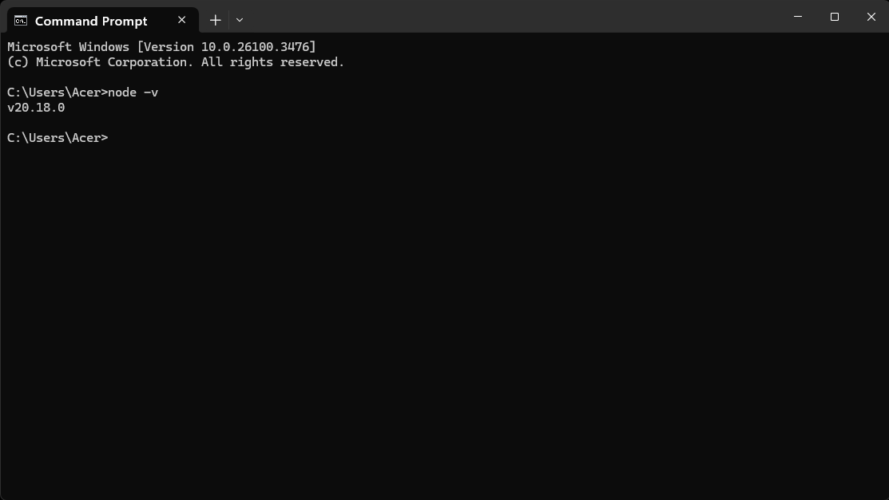

# IP-Protection




image.png

A brief description of what your project does and who it's for.

## 🚀 Features

- Feature 1
- Feature 2
- Feature 3

## 🛠️ Tech Stack

- Frontend: React, TailwindCSS
- Backend: Node.js, Express
- Blockchain: Solidity, Truffle
- Database: Firebase

## 🧪 Installation

1. Clone the repo:
   ```bash
   git clone https://github.com/your-username/your-project-name.git
